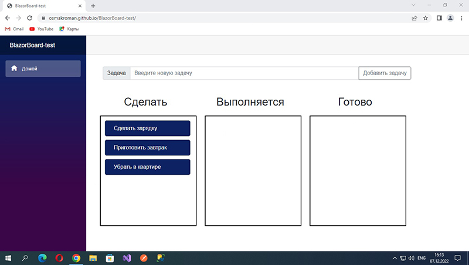

# BlazorBoard-test

Microsoft Blazor WebAssembly приложение, реализующее функционал Kanban-доски (наподобие Trello).

Онлайн версия на Github Pages [тут](https://osmakroman.github.io/BlazorBoard-test/).

#

#

Использовались .NET 6, Microsoft Visual Studio 2022.